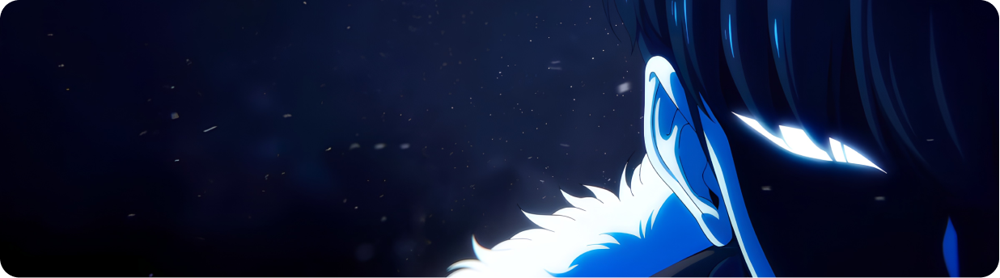

<div align="center">


# PMI ART

**A creative design community where ideas meet and artists grow together.**

[](https://pmi-art.vercel.app/)
[](https://github.com/Alif1507/PMI-ART)


</div>

---

## 🎨 Overview

**PMI ART** is a responsive web platform for a creative design community with an anime-inspired **Solo Leveling / Dark Fantasy** aesthetic. Members participate in design missions, earn **Arwah** points, and compete on a public leaderboard — all wrapped in a sleek, cinematic UI.

<div align="center">
  
</div>

---

## ✨ Features

| Feature | Description |
|---|---|
| 🏠 **Home Page** | Full-viewport hero with animated character & ghost watermark background. Non-scrollable, locks to the screen. |
| 🎯 **Events Page** | Browse active design missions/events displayed as stylized dark cards with mission details, deadlines, and Arwah rewards. |
| 🏆 **Leaderboard** | Podium display for top 3 members + ranked list for all participants. Filterable by time period. |
| 💬 **Mission Modal** | Click any event card to open an animated modal with full mission details and a call-to-action button. |
| 🎬 **GSAP Animations** | Smooth entrance animations for every page using GSAP timelines. |
| 🌊 **Lenis Smooth Scroll** | Buttery smooth inertia scrolling on Events & Leaderboard pages. |
| 📱 **Fully Responsive** | Optimized for desktop, tablet, and mobile — the home page always fits the screen exactly. |

---

## 🖼️ Preview

### 🏠 Home
> Full-viewport hero — text left, animated character right, faint ghost watermark in background.

<div align="center">
  
</div>

### 🎯 Events Banner

<div align="center">
  
</div>

### 🏅 ARISE Badge

<div align="center">
  
</div>

---

## 🛠️ Tech Stack

| Layer | Technology |
|---|---|
| **Markup** | HTML5 (semantic) |
| **Styling** | Vanilla CSS3 (custom properties, `clamp()`, `dvh`, Grid, Flexbox) |
| **Scripting** | Vanilla JavaScript ES6+ |
| **Animations** | [GSAP 3](https://greensock.com/gsap/) + ScrollTrigger (via CDN) |
| **Smooth Scroll** | [Lenis](https://lenis.darkroom.engineering/) v1.1.9 (via CDN) |
| **Fonts** | [Plus Jakarta Sans](https://fonts.google.com/specimen/Plus+Jakarta+Sans) (Google Fonts) |
| **Build Tool** | None — zero-build, open `index.html` directly |

---

## 🎨 Design System

### Color Palette

| Variable | Hex | Usage |
|---|---|---|
| `--primary-blue` | `#0D47A1` | Brand primary |
| `--vibrant-blue` | `#1565C0` | Buttons, active nav pills |
| `--vibrant-blue-hover` | `#1E88E5` | Hover states |
| `--aura-glow` | `#00D2FF` | Glow effects, accents |
| `--bg-light` | `#F4F6F9` | Page background |
| `--bg-dark-banner` | `#060A17` | Events banner background |
| `--text-dark` | `#212121` | Primary text |
| `--text-muted` | `#4B5563` | Secondary text |

### Typography
- **Font**: `Plus Jakarta Sans` (400 · 500 · 600 · 700 · 800)
- **Hero Title**: `clamp(3rem, 5.5vw, 4.6rem)` · ExtraBold
- **Section Titles**: `1.5rem–1.75rem` · Bold
- **Body**: `0.875rem–1rem` · Regular/Medium

---

## 📁 Project Structure

```
PMI-ART/
├── index.html          # Main HTML — Home, Events & Leaderboard sections
├── styles.css          # Full design system & component styles
├── main.js             # GSAP animations, Lenis scroll, tab navigation
└── assets/
    ├── Clip path group.png          # PMI ART ARISE logo (nav/events banner)
    ├── Clip path group-2.png        # Event card background #1 & #3
    ├── Clip path group-3.png        # Event card background #4
    ├── Group.png                    # Events banner — Sung Jin-Woo art
    ├── Mask group.png               # Event card background #2
    ├── Web PMI Design (Home) (2) 1.png  # ARISE badge (leaderboard podium)
    ├── Web PMI Design (Home) (4).png    # Hero character — color (main image)
    └── Web PMI Design (Home) (5).png    # Hero character — ghost/watermark
```

---

## 🚀 Getting Started

No installation or build step required.

**Option 1 — Open directly:**
```
Double-click index.html
```

**Option 2 — Local dev server (recommended for assets):**
```bash
# Python
python -m http.server 8080

# Node.js
npx serve .

# Then open → http://localhost:8080
```

---

## 📐 Pages & Sections

### 🏠 Home
- **Hero** — Full-viewport, non-scrollable layout. Anime character fills the right half. Ghost watermark sits center-right behind the text.
- **Text** — "Welcome to PMI ART" + subtitle + **Explore Events →** CTA button
- **Interaction** — CTA navigates to the Events tab with a smooth animated transition

### 🎯 Events
- **Banner** — Full-width dark cinematic banner with the ARISE logo and Solo Leveling character art
- **Mission Cards** — 4 cards, each showing: mission title, quote, mission description, canvas size, deadline, and max Arwah value
- **Bangkitkan Modal** — Clicking any card opens an animated overlay modal with full details and a join CTA

### 🏆 Leaderboard
- **Podium** — Top 3 ranked members displayed as elevated cards (JUARA 1 · 2 · 3) with ARISE badge
- **Rank List** — Scrollable ranked table for all remaining participants
- **Filters** — Time period tabs: Minggu Ini · Bulan Ini · Semua

---

## 🎬 Animation Details

| Section | Animation |
|---|---|
| Home hero text | Fade + slide up (staggered: title → subtitle → CTA) |
| Home character | Slide in from right |
| Home ghost | Fade in (opacity 0 → 0.55) |
| Events banner | Scale + fade reveal |
| Event cards | Stagger fade + slide up |
| Leaderboard podium | Height reveal (JUARA 2 → 1 → 3 sequence) |
| Rank rows | Stagger slide from left |

All animations use **GSAP timelines** and are triggered on tab switch — not on scroll — ensuring they replay every time you navigate to that section.

---

## 🌐 Responsive Breakpoints

| Breakpoint | Behavior |
|---|---|
| `> 1024px` | Full two-column hero layout |
| `≤ 1024px` | Character anchors bottom-right, text shifts left |
| `≤ 768px` (tablet) | Header compresses to 56px · Text pins top-left · Character bottom-right at 72% height |
| `≤ 480px` (mobile) | Header 52px · Character 65% · Font scales down via `clamp()` |

---

## 🙏 Credits

- **Artwork & Character Design** — PMI ART Creative Team
- **UI Design** — Based on Solo Leveling / Dark Anime Fantasy aesthetic
- **Animation Library** — [GSAP by GreenSock](https://greensock.com)
- **Scroll Library** — [Lenis by Darkroom](https://lenis.darkroom.engineering/)
- **Font** — [Plus Jakarta Sans by Tokotype](https://fonts.google.com/specimen/Plus+Jakarta+Sans)

---

<div align="center">

Made with ❤️ by **PMI ART**

*"Setiap Hunter hebat memulai langkahnya dari hal yang sederhana..."*

</div>
